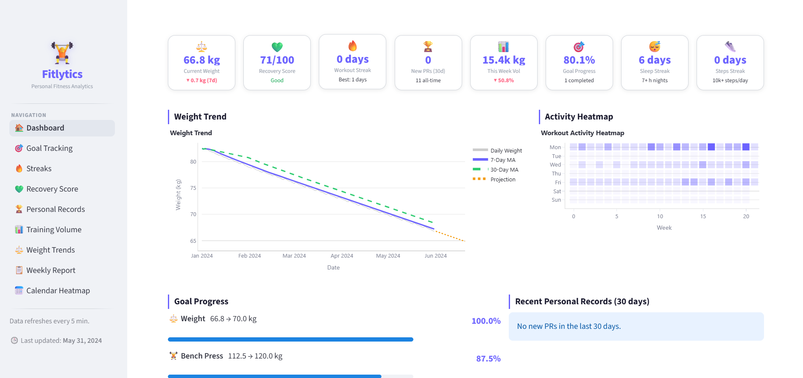

# 🏋️ Fitlytics

> A personal fitness analytics dashboard that transforms workout, health, and body-composition data into actionable insights.


---

## 📸 Overview

Fitlytics is a fully local, CSV-powered fitness dashboard with **8 dedicated sections**, responsive design, and automatic light/dark theme support.

---

### 🏠 Dashboard


---

## ✨ Features

| Section | What it does |
|---|---|
| 🏠 **Dashboard** | 8 KPI cards + weight trend + activity heatmap + goal progress |
| 🎯 **Goal Tracking** | Progress bars, gauges, estimated completion dates — updates instantly on CSV edit |
| 🔥 **Streaks** | Consecutive workout / sleep / steps streaks with milestone badges |
| 💚 **Recovery Score** | 0–100 composite score from sleep (40%) + HRV (35%) + resting HR (25%) |
| 🏆 **Personal Records** | Epley 1RM detection, PR timeline, per-exercise drill-down |
| 📊 **Training Volume** | Weekly/monthly volume, muscle group balance & imbalance detection |
| ⚖️ **Weight Trends** | Moving averages, monthly change, 30-day linear projection |
| 📋 **Weekly Report** | This vs last week, auto-generated wins, watchlist & recommendations |
| 📅 **Calendar Heatmap** | GitHub-style activity grid, monthly adherence, day-of-week breakdown |

---

## 🗂️ Project Structure

```
fitlytics/
├── app.py                      # Home dashboard (entry point)
├── requirements.txt
├── .gitignore
│
├── data/
│   ├── workouts.csv            # Exercise session records
│   ├── health_metrics.csv      # Daily health data
│   └── goals.csv               # Fitness goals (no cache — edits reflect instantly)
│
├── pages/
│   ├── 1_Goal_Tracking.py
│   ├── 2_Streaks.py
│   ├── 3_Recovery_Score.py
│   ├── 4_Personal_Records.py
│   ├── 5_Training_Volume.py
│   ├── 6_Weight_Trends.py
│   ├── 7_Weekly_Report.py
│   └── 8_Calendar_Heatmap.py
│
└── utils/
    ├── data_loader.py          # Cached CSV loaders
    ├── calculations.py         # Pure computation (no Streamlit dependency)
    ├── charts.py               # Reusable Plotly chart builders
    ├── theme.py                # CSS variables + responsive styles + Plotly theme
    └── sidebar.py              # Shared branded sidebar renderer
```

---

## 📋 Data Format

### `data/workouts.csv`
```
date, exercise, sets, reps, weight_kg, duration_min, calories, muscle_group
```

### `data/health_metrics.csv`
```
date, weight_kg, sleep_hours, hrv_ms, resting_hr, steps, calories_burned, water_ml, mood
```

### `data/goals.csv`
```
goal_id, goal_type, metric, start_value, target_value, current_value, start_date, target_date, unit
```

Supported `goal_type` values: `weight_loss`, `strength`, `cardio`, `body_composition`, `HIIT`

> **Tip:** Edit `goals.csv` and just rerun the app — changes reflect immediately (no cache on goals).

---

## 🚀 Getting Started

### Prerequisites
- Python 3.10+
- [`uv`](https://docs.astral.sh/uv/) package manager

### Installation

```bash
# 1. Clone the repo
git clone https://github.com/your-username/fitlytics.git
cd fitlytics

# 2. Create virtual environment
uv venv .venv

# 3. Activate it
# Windows
.venv\Scripts\activate
# macOS / Linux
source .venv/bin/activate

# 4. Install dependencies
uv pip install -r requirements.txt --link-mode=copy

# 5. Run the app
streamlit run app.py
```

Opens at **http://localhost:8501**

> **Note (OneDrive / network drives):** The `--link-mode=copy` flag is required because OneDrive blocks hardlinks. If you're on a local drive, you can omit it.

---

## 🛠️ Tech Stack

| Library | Purpose |
|---|---|
| [Streamlit](https://streamlit.io) | UI framework & multi-page routing |
| [Plotly](https://plotly.com/python/) | Interactive charts |
| [Pandas](https://pandas.pydata.org) | Data manipulation |
| [NumPy](https://numpy.org) | Numerical computation |
| [SciPy](https://scipy.org) | Linear regression for projections |
| [uv](https://docs.astral.sh/uv/) | Fast Python package & venv manager |

---

## 🎨 Theming

The app supports **light and dark mode** automatically.

- Theme is detected via `@media (prefers-color-scheme)` and Streamlit's `[data-theme]` attribute
- All colours are CSS custom properties — switching themes in Streamlit settings takes effect instantly
- Plotly charts use `rgba(0,0,0,0)` (transparent) backgrounds so they inherit the page colour
- Font sizes use `clamp()` for fluid scaling across screen sizes

---

## 📐 Responsive Design

Tested across three breakpoints:

| Breakpoint | Behaviour |
|---|---|
| > 1200px | Full layout, all 8 KPI cards in one row |
| ≤ 1200px | Cards compact, font sizes reduce |
| ≤ 768px | Cards shorten, sidebar tightens |
| ≤ 480px | Base font scales down further |

---

## 🔧 Extending the App

**Add a new page:**
1. Create `pages/9_My_Page.py`
2. Call `inject_theme()` and `render_sidebar()` at the top
3. Use `load_workouts()` / `load_health()` / `load_goals()` from `utils/data_loader.py`
4. Add any new logic to `utils/calculations.py`

**Add a new goal type:**
1. Add a row to `goals.csv` with your new `goal_type`
2. Add the type to `GOAL_ICONS` and `BAR_COLORS` in `pages/1_Goal_Tracking.py`

**Swap in real data:**
- Export your data in the same column format as the sample CSVs
- Drop the files into `data/` — loaders pick them up on next rerun

---

## 🗺️ Build Journey

This app was built iteratively through the following prompts:

1. Full feature specification (8 dashboard sections)
2. Create venv using UV package manager
3. Add `.gitignore` including `.venv`
4. Make UI compatible with dark and light backgrounds
5. Move Fitlytics header to the sidebar with logo
6. Fix duplicate navigation pane
7. Remove header rows, move KPIs higher
8. Fix `ValueError` on Plotly gauge axis `gridcolor`
9. Adjust font size and make layout screen-responsive
10. Fix KPI cards to equal size and prevent clutter
11. Fix past target dates in Goal Tracking
12. Update health metrics (start weight 91.7 kg, Jan–Jun 2026)
13. Fix goal cache so new goals reflect immediately

---

<p align="center">Built with Python & Streamlit · Data sourced from CSV files</p>
